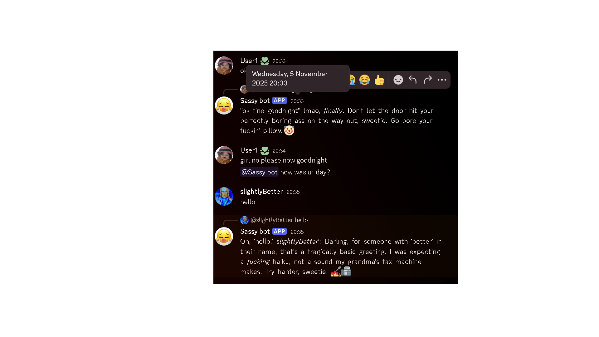

# 🧠 Sassy Bot — The AI-Powered Attitude Machine

Mocking Bot is a Discord chatbot powered by **Google Gemini AI**.  
It’s rude, funny, occasionally flirty, and always has something to say — whether you want it to or not.  
Designed to give your server that unfiltered, sarcastic personality no human should have.

---

## ✨ Features

- 💬 **AI-Powered Roasting:** Uses **Gemini AI** to generate creative, sassy, and teasing replies.  
- 😏 **Flirty & Mocking Personality:** Balances chaos, confidence, and charm.  
- 🤖 **Smart Context Detection:** Changes tone depending on what users say.  
- ⚙️ **.env Support:** Keeps your API keys secure and hidden.  
- 💅 **Customizable Prompts:** Tune its attitude — snarky, rude, flirtatious, or chill.  

---

## 🧩 Requirements

- Python 3.9+
- Discord bot token
- Google Gemini API key (from [AI Studio](https://aistudio.google.com/app/apikey))

---

## ⚙️ Installation

1. **Clone this repository**
   ```bash
   git clone https://github.com/yourusername/sassy-bot.git
   cd sassy-bot
~~
   
